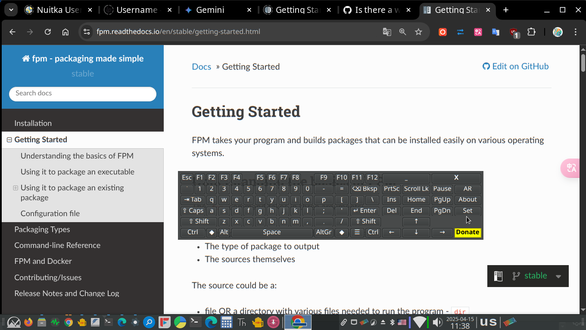

# pyXkeyboard v1.01

A simple, customizable on-screen virtual keyboard for Linux systems (primarily X11/Xorg), featuring layout switching, key simulation via XTEST, and optional auto-show functionality using AT-SPI.


*(Suggestion: Replace placeholder.png with an actual screenshot of the keyboard)*

## Key Features

*   **On-Screen Typing:** Click keys to simulate input into other applications (using XTEST).
*   **System Layout Switching:** Easily switch between configured system keyboard layouts (e.g., English, Arabic) using the `Lang` button or the system tray menu (requires `setxkbmap`).
*   **Visual Layout Display:** Keyboard display automatically reflects the currently active system layout.
*   **Modifier Keys:** Functional `Shift`, `Ctrl`, `Alt`, and `Caps Lock` keys. Modifiers like Shift, Ctrl, Alt auto-release after the next non-modifier key press.
*   **Right-Click Shift:** Right-click character keys to simulate `Shift + Key`.
*   **Customization:**
    *   Adjust font family and size.
    *   Change button text color.
    *   Set window background opacity.
    *   Choose button style (Default, Flat, Gradient).
*   **System Tray Integration:** Minimize to tray, select layout, show keyboard, and quit from the tray menu.
*   **Configuration:**
    *   Remember window position and size.
    *   Optional middle-click on background to hide to tray.
    *   Toggle auto-show feature.
*   **Auto-Show (Optional):** Automatically display the keyboard when focus enters an editable text field (requires AT-SPI).
*   **Movable:** Drag the window background to reposition.
*   **Always on Top:** Stays visible above other windows.

## System Requirements

*   **Operating System:** **Linux** (Designed and tested primarily on **X11/Xorg** sessions).
    *   *Note:* Key simulation (XTEST), system layout switching (`setxkbmap`), and focus monitoring (AT-SPI) may have limited or no functionality on Wayland sessions depending on the compositor and configuration.
*   **Python:** Python 3.x

## Installation & Dependencies

Follow these steps to get `pyxkeyboard` running:

**1. Dependencies:**

You need Python 3 and several libraries. Installation commands are shown for Debian/Ubuntu-based systems. Use your distribution's package manager for equivalents.

*   **Core GUI (PyQt6):**
    ```
    python3 -m pip install PyQt6
    # or potentially: sudo apt install python3-pyqt6
    ```
*   **Key Simulation (XTEST):**
    ```
    python3 -m pip install python-xlib
    # or potentially: sudo apt install python3-xlib
    ```
*   **System Layout Switching (`setxkbmap` command):**
    This command is usually pre-installed with Xorg. If missing:
    ```
    sudo apt install x11-xkb-utils
    ```
*   **Auto-Show Feature (AT-SPI):** (Optional, only needed for auto-show)
    ```
    # Install Python GI bindings and AT-SPI introspection data
    sudo apt install python3-gi gir1.2-atspi-2.0

    # IMPORTANT: Ensure Accessibility Services (AT-SPI) are enabled!
    # Check your Desktop Environment's settings (Accessibility/Universal Access).
    # You might need to log out and back in after enabling it.
    # You can often check if it's running via: ps aux | grep -i at-spi
    ```

**2. Get the Code:**

Clone the repository:
```
git clone https://github.com/your-username/pyxkeyboard.git # Replace with your actual repo URL
cd pyxkeyboard
