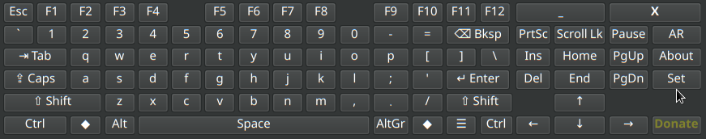

# pyxkeyboard v1.0.2

A simple, customizable on-screen virtual keyboard for Linux systems (primarily X11/Xorg), featuring layout switching, key simulation via XTEST, and optional auto-show functionality using AT-SPI.



## Key Features

*   **On-Screen Typing:** Click keys to simulate input into other applications (using XTEST).
*   **System Layout Switching:** Easily switch between configured system keyboard layouts (e.g., English, Arabic) using the `Lang` button or the system tray menu (requires `setxkbmap`).
*   **Visual Layout Display:** Keyboard display automatically reflects the currently active system layout.
*   **Modifier Keys:** Functional `Shift`, `Ctrl`, `Alt`, and `Caps Lock` keys. Modifiers like Shift, Ctrl, Alt auto-release after the next non-modifier key press.
*   **Right-Click Shift:** Right-click character keys to simulate `Shift + Key`.
*   **Movable:** Drag the window background using the **left mouse button** to reposition (works whether frameless or framed).
*   **System Tray Integration:** Minimize to tray, select layout, show keyboard, and quit from the tray menu (uses a keyboard icon).
*   **Customization:**
    *   Adjust font family and size.
    *   Change button text color.
    *   Set window background opacity (effective when frameless).
    *   Choose button style (Default, Flat, Gradient).
*   **Configuration & Behavior:**
    *   **Always on Top:** Keep the keyboard window visible above other application windows (Window Manager dependent).
    *   **Frameless Window:** Option to remove the window title bar and borders.
    *   Remember window position and size.
    *   Optional middle-click on background to hide to tray.
    *   Toggle auto-show feature.
    *   Enable/disable key auto-repeat and configure delay/interval.
    *   **Show on all workspaces (Sticky):** _[Feature Not Currently Functional]_ Option exists in settings, but the underlying mechanism to make the window appear on all desktops is not currently active or guaranteed to work across all environments.

## System Requirements

*   **Operating System:** **Linux** (Designed and tested primarily on **X11/Xorg** sessions).
    *   *Note:* Key simulation (XTEST), system layout switching (`setxkbmap`), focus monitoring (AT-SPI), and window manager hints (Always on Top, Sticky) may have limited or no functionality on Wayland sessions depending on the compositor and configuration.
*   **Python:** Python 3.x

## Installation & Dependencies

Follow these steps to get `pyxkeyboard` running:

**1. Dependencies:**

You need Python 3 and several libraries. Installation commands are shown for Debian/Ubuntu-based systems. Use your distribution's package manager for equivalents.

*   **Core GUI (PyQt6):**
    ```bash
    sudo apt update
    sudo apt install python3-pyqt6
    # Or using pip: python3 -m pip install PyQt6
    ```
*   **Key Simulation (XTEST) & Window Properties (Sticky):**
    ```bash
    sudo apt install python3-xlib
    # Or using pip: python3 -m pip install python-xlib
    ```
*   **System Layout Switching (`setxkbmap` command):**
    This command is usually pre-installed with Xorg. If missing:
    ```bash
    sudo apt install x11-xkb-utils
    ```
*   **Auto-Show Feature (AT-SPI):** *(Optional, only needed for auto-show)*
    These are often installed by default on modern desktops, but if the feature doesn't work, ensure they are present:
    ```bash
    # Install Python GI bindings and AT-SPI introspection data
    sudo apt install python3-gi gir1.2-atspi-2.0

    # IMPORTANT: Ensure Accessibility Services (AT-SPI Bus) are enabled!
    # Check your Desktop Environment's settings (Accessibility/Universal Access).
    # You might need to log out and back in after enabling it.
    # You can often check if it's running via: ps aux | grep -i at-spi
    ```

**2. Get the Code:**

Clone the repository (replace with your actual repo URL if different):
```bash
git clone https://github.com/khaled151277/pyxkeyboard.git
cd pyxkeyboard