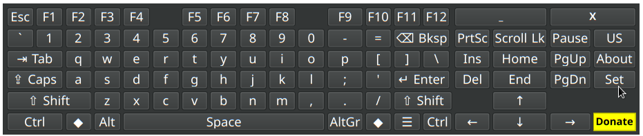

# pyxkeyboard v1.0.3

A simple, customizable OSK on-screen virtual keyboard for Linux systems (primarily X11/Xorg), featuring layout switching, key simulation via XTEST, and optional auto-show functionality using AT-SPI.


## Key Features

*   **On-Screen Typing:** Click keys to simulate input into other applications (using XTEST).
*   **System Layout Switching:** Easily switch between configured system keyboard layouts (e.g., English, Arabic) using the `Lang` button or the system tray menu (requires `setxkbmap`).
*   **Visual Layout Display:** Keyboard display automatically reflects the currently active system layout.
*   **Modifier Keys:** Functional `Shift`, `Ctrl`, `Alt`, and `Caps Lock` keys. Modifiers like Shift, Ctrl, Alt auto-release after the next non-modifier key press.
*   **Right-Click Shift:** Right-click character keys to simulate `Shift + Key`.
*   **Movable:** Drag the window background using the **left mouse button** to reposition (works whether frameless or framed).
*   **Always on Top:** Option to keep the keyboard window visible above other application windows (Default: On).
*   **System Tray Integration:** Minimize to tray, select layout, show keyboard, and quit from the tray menu (uses a keyboard icon).
*   **Key Auto-Repeat:** Enable/disable key repeat on long press (includes arrow keys, backspace, delete, space, tab, enter, letters, numbers, symbols) and configure initial delay and repeat interval.
*   **Customizable Appearance:**
    *   Adjust font family and size (Default: Noto Naskh Arabic 10pt).
    *   Change button text color.
    *   Optionally use **system theme colors** for window and button backgrounds (Default: On). If enabled:
        *   Button text color (black/white) is automatically chosen for contrast against the theme's button background.
        *   Custom background color settings and the "Button Style" setting are ignored.
    *   If *not* using system colors:
        *   Set custom window background color.
        *   Set custom button background color (mainly affects "Flat" style).
        *   Choose button style (Default, Flat, Gradient).
    *   Set window background **opacity** (works for both framed and frameless windows, compositor support required, Default: 0.9).
*   **Configurable Behavior:**
    *   **Frameless Window:** Option to remove the window title bar and borders (Default: On).
    *   Remember window position and size.
    *   Optional middle-click on background to hide to tray.
    *   **Auto-show when editing text:** Automatically shows the keyboard when focus enters an editable text field (requires AT-SPI accessibility services).
    *   **Show on all workspaces (Sticky):** _[Option available but Not Currently Functional]_ Intended to make the keyboard visible on all virtual desktops.

## System Requirements

*   **Operating System:** **Linux** (Designed and tested primarily on **X11/Xorg** sessions).
    *   *Note:* Key simulation (XTEST), system layout switching (`setxkbmap`), focus monitoring (AT-SPI), and window manager hints (Always on Top, Sticky) may have limited or no functionality on Wayland sessions depending on the compositor and configuration.
*   **Python:** Python 3.x

## Installation & Dependencies

Follow these steps to get `pyxkeyboard` running:

**1. Dependencies:**

You need Python 3 and several libraries. Installation commands are shown for Debian/Ubuntu-based systems. Use your distribution's package manager for equivalents.

*   **Core GUI (PyQt6):**
    ```bash
    sudo apt update
    sudo apt install python3-pyqt6
    # Or using pip: python3 -m pip install PyQt6
    ```
*   **Key Simulation (XTEST) & Window Properties (Sticky dependency):**
    ```bash
    sudo apt install python3-xlib
    # Or using pip: python3 -m pip install python-xlib
    ```
*   **System Layout Switching (`setxkbmap` command):**
    This command is usually pre-installed with Xorg. If missing:
    ```bash
    sudo apt install x11-xkb-utils
    ```
*   **Auto-Show Feature (AT-SPI):** *(Optional, recommended for auto-show)*
    These are often installed by default on modern desktops, but if the feature doesn't work, ensure they are present:
    ```bash
    # Install Python GI bindings and AT-SPI introspection data
    sudo apt install python3-gi gir1.2-atspi-2.0

    # IMPORTANT: Ensure Accessibility Services (AT-SPI Bus) are enabled!
    # Check your Desktop Environment's settings (Accessibility/Universal Access).
    # You might need to log out and back in after enabling it.
    # You can often check if it's running via: ps aux | grep -i at-spi
    ```
*   **(Optional) Fonts:** For the default appearance, install `fonts-noto-naskh-arabic`.
    ```bash
    sudo apt install fonts-noto-naskh-arabic
    ```

**2. Get the Code:**

Clone the repository (replace with your actual repo URL if different):
```bash
git clone https://github.com/your-username/pyxkeyboard.git
cd pyxkeyboard
```
Or download the source code archive.

**3. Installation (Choose ONE method):**

    # Install the  .deb file
    sudo dpkg -i pyxkeyboard_*.deb
    # Fix any missing dependencies (if any were missed above)
    sudo apt --fix-broken install
    # Update icon cache (Important!)
    sudo gtk-update-icon-cache /usr/share/icons/hicolor/
    # Update desktop database
    sudo update-desktop-database
    ```
    After installation, you should find "PyXKeyboard" in your application menu.
    To uninstall: `sudo apt remove pyxkeyboard`

*   **Method C: Running Directly (for quick tests, not recommended for regular use):**
    ```bash
    # From the project root directory
    python3 -m pyxkeyboard.main
    ```

## How to Use

1.  **Starting:** Launch "PyXKeyboard" from your application menu (if installed via DEB) or run `pyxkeyboard` or `python3 -m pyxkeyboard.main` from the terminal.
2.  **Typing:** Open your target application (e.g., text editor), then click keys on the virtual keyboard. Characters should appear if XTEST works.
3.  **Modifiers:**
    *   Click `Shift`, `Ctrl`, or `Alt` once. It highlights. Click the next non-modifier character or function key. The modifier then releases automatically.
    *   Right-clicking a character key simulates Shift + that key directly.
    *   Click `Caps Lock` to toggle the system's Caps Lock state (requires XTEST).
4.  **Using Arrow Keys:** Click the arrow keys (<code>↑</code>, <code>↓</code>, <code>←</code>, <code>→</code>). Long-pressing them will trigger auto-repeat if enabled.
5.  **Switching Layouts:**
    *   Click the `Lang` button (e.g., `AR` or `EN`) to cycle through system layouts.
    *   Right-click the **keyboard tray icon** -> "Select Layout" -> Choose layout (requires `setxkbmap` and multiple layouts configured in system).
6.  **Moving:** Click and drag the keyboard's background area with the **left mouse button**.
7.  **Minimizing / Hiding:**
    *   Click the standard close button (`X`) if the window has a frame. Hides to tray if available, otherwise quits.
    *   Click the custom `_` button (if frameless). Hides to tray if available, otherwise hides.
    *   If enabled in Settings, **middle-click** (mouse wheel click) anywhere on the keyboard's background area (not a button) to hide it to the tray/minimize/hide.
8.  **Showing from Tray:**
    *   **Left-click** the **keyboard icon** in the system tray.
    *   **Right-click** the **keyboard icon** -> "Show Keyboard".
9.  **Settings:** Click the **<code>Set</code>** button to open the Settings & Help window (fixed size 500x500). Configure:
    *   **General Tab:** Remember Geometry, Always on Top, Sticky (Not Functional), Middle-click Hide, Auto-Show, Frameless Window.
    *   **Appearance Tab:** Font, Button Text Color, Use System Theme Colors (overrides custom backgrounds/button style), Custom Window/Button Background Colors, Background Opacity, Custom Button Style (disabled if using system colors).
    *   **Typing Tab:** Enable/disable Auto-Repeat, configure Delay and Interval.
    *   **Help Tabs:** View help guides (English and Arabic).
10. **Quitting:**
    *   Click the custom `X` button (if frameless).
    *   Right-click the **keyboard tray icon** -> "Quit".
    *   Close the window via the standard close button if it's framed and no system tray is available.

## Troubleshooting

*   **Typing doesn't work / wrong characters:** Check XTEST status in "About". Ensure `python-xlib` is installed and you're likely on X11/Xorg, not Wayland. Wrong characters might mean system layout (`setxkbmap`) differs from visual expectation.
*   **Language switching doesn't work:** Check XKB status in "About". Ensure `setxkbmap` (from `x11-xkb-utils`) is installed. You might need multiple layouts configured in your OS settings.
*   **Tray icon missing:** System tray support might be missing or need configuration on some desktops.
*   **Middle-click hide doesn't work:** Ensure option is checked in Settings -> General.
*   **Auto-Show doesn't work:** Ensure option is checked. Verify AT-SPI dependencies (`python3-gi`, `gir1.2-atspi-2.0`) are installed and **Accessibility Services (AT-SPI Bus) are running** in your system/desktop settings (may require logout/login). Check AT-SPI status in "About". Less reliable on Wayland.
*   **Window doesn't stay on top:** Ensure "Always on Top" is checked in Settings. Feature depends on Window Manager support.
*   **"Sticky" option doesn't work:** This feature (making the window appear on all workspaces) is currently **not functional**.
*   **Appearance issues (Transparency/Colors):** Background opacity and custom colors might look different or have artifacts depending on your Window Manager and whether a compositor is running. Using system theme colors is generally more reliable for button appearance. If using custom colors, the "Flat" button style is most affected by the "Button Background Color" setting.
*   **Application icon is generic:** After installing the DEB package, run `sudo gtk-update-icon-cache /usr/share/icons/hicolor/ && sudo update-desktop-database` and then log out and log back in.
*   **Settings not saved/loaded correctly:** Ensure the directory `~/.pyxkeyboard` exists and your user has write permissions. Delete the `settings.json` file inside it to reset to defaults if needed.

## About

*   **Version:** 1.0.3
*   **Developer:** Khaled Abdelhamid
*   **Contact:** khaled1512@gmail.com
*   **License:** GPL-3.0
*   **Support:** If you find this useful, consider supporting development via PayPal: [paypal.me/kh1512](https://paypal.me/kh1512)
